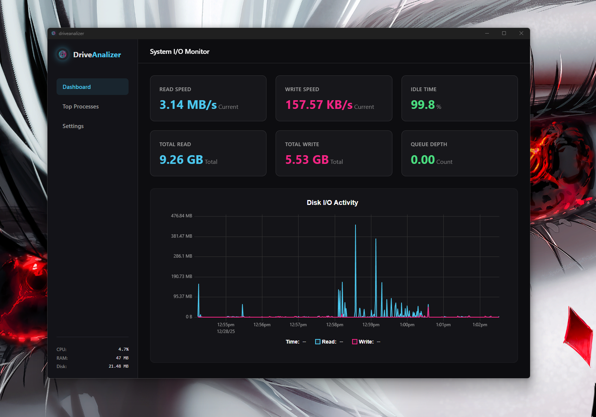

# DriveAnalizer 🚀

**DriveAnalizer** is a high-performance desktop application designed to monitor and analyze system performance, specifically Disk I/O and processes, in real-time.

Built on the **Tauri v2** architecture, it combines the flexibility of modern web technologies (React) with the power of system programming (Rust).

---

## 📸 Screenshots

| Dashboard (Disk I/O) | Process Monitor (Top Processes) |
|:---:|:---:|
|  |  |

---

## ✨ Features

*   **Real-Time Monitoring:** Track disk read/write speeds and system resources with millisecond latency.
*   **High-Performance Charts:** Draw thousands of data points without straining the CPU thanks to the `uPlot` library.
*   **Efficient Data Storage:** Using `SQLite` and `SQLx`, data is stored locally without affecting system performance (via WAL mode).
*   **Smart Buffering:** Data is buffered in RAM and written to disk in batches to preserve disk life and prevent I/O bottlenecks.
*   **Lightweight & Fast:** Significantly lower RAM and CPU consumption compared to Electron alternatives.
*   **Process Tracking:** Instantly view the processes consuming the most system resources.

---

## 🛠️ Tech Stack & Architecture

DriveAnalizer is built using "Best-in-Class" technologies.

### Backend (Rust 🦀)
*   **Framework:** [Tauri v2](https://v2.tauri.app/)
*   **Runtime:** [Tokio](https://tokio.rs/) (Async runtime)
*   **System Monitoring:** `sysinfo` (Cross-platform hardware metrics)
*   **Database:** `SQLite` + `SQLx` (Compile-time query checking and Async I/O)
*   **Serialization:** `Serde`

### Frontend (React ⚛️)
*   **Framework:** React 19 + Vite
*   **Language:** TypeScript
*   **State Management:** [Zustand](https://github.com/pmndrs/zustand)
*   **Visualization:** [uPlot](https://github.com/leeoniya/uPlot) (Canvas-based ultra-fast charts)
*   **Styling:** CSS Modules / Clsx

### Architecture Summary
The application uses a **Producer-Consumer** model:
1.  **Collector Thread (Rust):** Periodically collects system data.
2.  **IPC Bridge:** Data is "pushed" to the Frontend instantly (Event-driven).
3.  **Persistence Layer:** Data is accumulated in memory and written to the database in batches at specific intervals.

---

## 🚀 Installation & Development

Follow the steps below to run the project in your local environment.

### Requirements
*   **Node.js** (v18 or higher)
*   **Rust** (Latest stable version)
*   **Pnpm** (or npm/yarn)
*   **Visual Studio Code** (Recommended extensions: `rust-analyzer`, `Tauri`)

### Step-by-Step Setup

1.  **Clone the repository:**
    ```bash
    git clone https://github.com/username/DriveAnalizer.git
    cd DriveAnalizer
    ```

2.  **Install dependencies:**
    ```bash
    pnpm install
    ```

3.  **Run in development mode:**
    This command starts both the Frontend server and the Tauri application.
    ```bash
    pnpm tauri dev
    ```

4.  **Production Build:**
    ```bash
    pnpm tauri build
    ```

---

## 📄 License

This project is licensed under the MIT License. See the `LICENSE` file for details.
